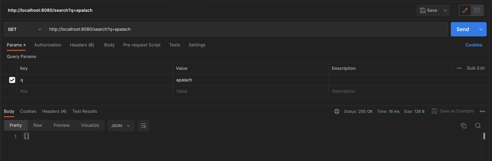

# PRJCTR HW11: Elasticsearch

The task is to set up elasticsearch container which can serve 
autocomplete needs with leveraging typos and errors 
(max 3 typos if word length is bigger than 7) using English vocabulary.

It was done as a simple web-server using fastapi python lib.

## Prerequisites

* Installed [Docker](https://www.docker.com/products/docker-desktop/).

## Start

```bash
$ docker-compose up -d
```

This will automatically start the elasticsearch container and web-app, 
on startup will create an index with all needed settings and insert 
some data to check.

## Results

### Inserting more documents

To insert new document you should trigger following endpoint:

```
POST http://localhost:8080/insert
{
    "name": "A Walk in the Woods: Rediscovering America on the Appalachian Trail",
    "description": "The Appalachian Trail stretches from Georgia to Maine and covers some of the most breathtaking terrain in America—majestic mountains, silent forests, sparking lakes. If you’re going to take a hike, it’s probably the place to go. And Bill Bryson is surely the most entertaining guide you’ll find. He introduces us to the history and ecology of the trail and to some of the other hardy (or just foolhardy) folks he meets along the way—and a couple of bears. Already a classic, A Walk in the Woods will make you long for the great outdoors (or at least a comfortable chair to sit and read in)."
}
```

To search with fuzziness you should trigger following endpoint 
with query length more than 7:

```
GET http://localhost:8080/search?q=apalachi%20trail
```

The book's description from above should be returned:


If the query length will be less than or equals to 7, 
then the exact match search will be executed:




